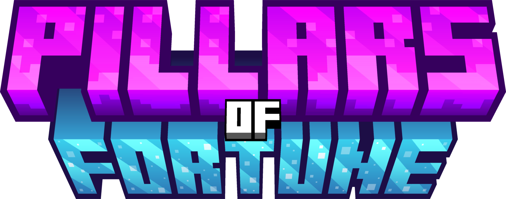

GourPillars (full name **Gour Pillars Of Fortune**) is a Paper plugin implementing the "Pillars Of Fortune" last-man-standing minigame: players fight on a set of collapsing pillars while random items drop periodically, until a single survivor remains.

## Requirements

- Paper (or a Paper fork) 1.21.11
- Java 21
- [Multiverse-Core](https://github.com/Multiverse/Multiverse-Core) (required, used for per-arena world handling)
- [PlaceholderAPI](https://github.com/PlaceholderAPI/PlaceholderAPI) (optional, enables the placeholders below)
- MySQL or SQLite, used for persistent player statistics

## Features

- Multi-arena system with independently configurable regions, spawns, and player limits
- Dynamic pillar collapse mechanic with periodic random item/block distribution
- Voted, weighted-random game events (Lava, Knockback, Border) with a slot-machine selection animation
- Party system with public/private parties, per-action permissions and a server-wide broadcast invite
- Persistent player statistics, backed by an async MySQL or SQLite database
- Lobby, waiting-room and in-game scoreboards
- MiniMessage-based, fully configurable messages and menus
- PlaceholderAPI expansion for arena and player statistics

See [docs/features.md](docs/features.md) for details on each.

## Documentation

- [Commands & Permissions](docs/commands.md)
- [Features](docs/features.md)
- [Configuration (`config.yml`)](docs/config.md)
- [Database (`database.yml`)](docs/database.md)
- [Setting Up an Arena](docs/arenas.md)
- [Placeholders](docs/placeholders.md)

## Building from Source

```
./gradlew build
```

The shaded plugin jar is produced at `build/libs/GourPillars-<version>-all.jar`.

## License

GPLv3, see [LICENSE](LICENSE).
